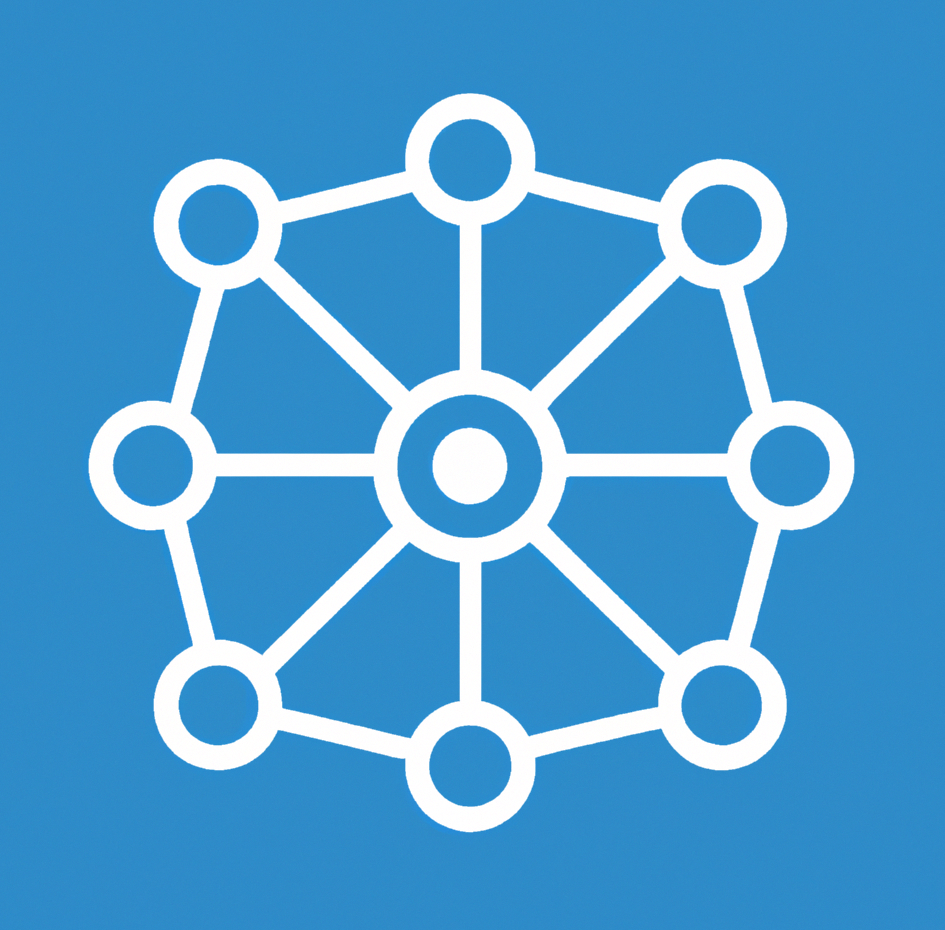

<!-- markdownlint-disable no-inline-html -->

<h1 align="center">Developers Italia API</h1>

<p align="center">
  
</p>

<p align="center">
  <a href="https://goreportcard.com/report/github.com/italia/developers-italia-api">
    
  </a>
  
  <a href="https://slack.developers.italia.it">
    
  </a>
</p>

<div align="center">
  <h3>
    <a href="https://developers-italia-4gfxiabty-dip-trasformazione-digitale.vercel.app/it/api/developers-italia">
      API documentation
    </a>
  </h3>
</div>

<p align="center">
  Developers Italia API is the RESTful API of the Free and Open Source software catalog
  aimed at Italian Public Administrations.
</p>

# Requirements

* Golang 1.18
* [PostgreSQL](https://https://www.postgresql.org/)

# Development

The application uses [https://github.com/cosmtrek/air](Air) for live-reloading
in the development environment.

To start developing:

1. Clone the repo
2. Build and start the containers

   ```shell
   docker compose up
   ```

Docker Compose will bring up the app and PostgreSQL containers.

Wait until the Docker logs explicitly say the API is up and you can use its
endpoints at `http://localhost:3000/v1/`.

The application will automatically reload when a change is made.

# Configuration

You can configure the API with environment variables:

* `MAX_REQUESTS` (optional): number of requests per minute after which responses
  will be ratelimited.
  Default: no limit.

# Contributing

This project exists also thanks to your contributions! Here is a list of people
who already contributed to this repository:

<a href="https://github.com/italia/developers-italia-api/graphs/contributors">
  
</a>

# License

Copyright © 2022 - Presidenza del Consiglio dei Ministri

The source code is released under the AGPL version 3.
